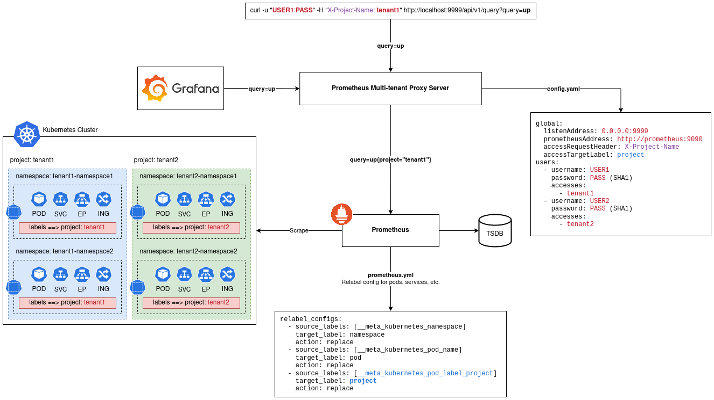

# prometheus-multi-tenant-proxy-server

Tiny reverse proxy server to make Prometheus multi-tenant. This reverse proxy provides a little Authentication/Authorization layer on top of Prometheus and injects the target label into all user queries.

## Where we need this project?

  - Where you need Authentication/Authorization for Prometheus.
  - Where you need to restrict users to be able to access a set of metrics.
  - Where you need to implement Multi-tenancy based on specific metric labels.
  - Where you need a proxy to check what the user does in your system.

## Architecture:

Here is the big picture of the architecture to monitor Kubernetes cluster in a multi-tenant model.



## Get started guide:

You can deploy `prometheus-multi-tenant-proxy-server` anywhere. However, we prepared several Kubernetes resources - Helm chart and Kustomize files - to help you quickly deploy this project into Kubernetes.

To create a proper config, see examples under the `examples` directory.

#### Helm chart installation:

```bash
helm install prometheus-multi-tenant-proxy-server \
  ./deployments/chart/ \
  -n prometheus \
  --create-namespace \
  -f YOURVALUES.yaml
```

#### Kustomize installation:

```bash
kubectl apply -k deployments/kustomize
```

#### Docker installation:

```bash
docker run --name prometheus-multi-tenant-proxy-server -d -p 9999:9999 \
  -v /path/to/your/config.yaml:/opt/config/config.yaml \
  ssbostan/prometheus-multi-tenant-proxy-server:latest
```

## Related materials:

  - [Introduction and Quick demo, Cloud Native London, April 2023](https://www.youtube.com/live/SAF1OC5SpnY?feature=share&t=2490)

Copyright 2023 Saeid Bostandoust <ssbostan@yahoo.com>
